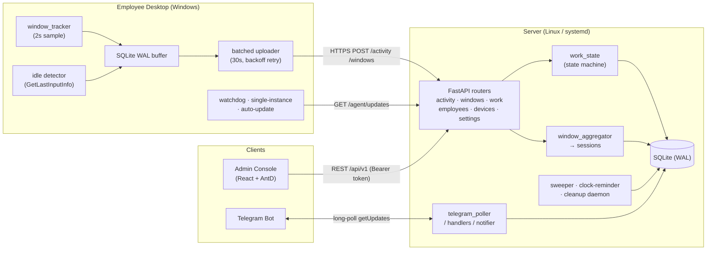
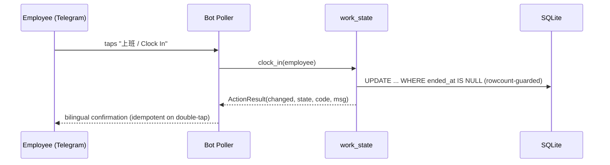

# Worktide · Remote Team Activity Analytics & Attendance

> **隐私优先的远程团队活动分析与考勤平台** — a privacy-first, full-stack system that turns raw desktop activity into team-running analytics and Telegram-driven attendance, designed to run unattended in production.

<p>


</p>

---

## Overview / 简介

**Worktide** is a three-tier system, designed and built end-to-end: a **Windows agent** that observes desktop activity, a **FastAPI service** that interprets it into a work-state machine + attendance records, and a **React admin console** for analytics — wired together with a **Telegram bot** for self-service punch-in/out and bilingual notifications.

它由三层加一个机器人组成:

- **客户端 Agent**(Windows):只观察,不监视——采集前台窗口、空闲秒数,本地缓冲、断网续传、零丢失。
- **服务端 Service**(FastAPI):把原始活动解释成工时状态机与考勤事件,跑后台清扫、提醒调度、设置中心、Telegram 机器人。
- **管理后台 Admin**(React + AntD):设备、员工、工时、窗口分析、实时活动、运行时设置等可视化面板。
- **Telegram 机器人**:员工在群里自助打卡(上/下班、用餐/抽烟/如厕、回座),系统双语通知、@提醒、群发上下班提醒。

> **Privacy by design / 隐私优先**: the agent collects *only* process name, window title, timestamps, and idle seconds. It **never** captures screenshots, keystrokes, URLs, clipboard, or file contents. Deploy only on company-owned devices with informed consent.

---

## Architecture / 架构



### Punch-in flow / 打卡时序



---

## Engineering Highlights / 工程亮点

The system is built to survive networks, restarts, and double-clicks without losing data or spamming users.

| # | Capability | What makes it interesting |
|---|---|---|
| 1 | **Offline-first, zero-loss pipeline** | The agent writes every window event to a local **SQLite WAL** buffer first, then a batched uploader drains it. Server down? The agent backs off (5/30/120/300s) and keeps buffering; on recovery it replays — **no data loss across crashes, reboots, or outages.** |
| 2 | **Idempotent work-state machine** | `clock_in / clock_out / start_break / return_to_work / expire_overdue_break` each return an `ActionResult(changed, work_state, code, message)`. Re-running an action is a safe no-op; concurrent break closing uses a **rowcount-guarded `UPDATE ... WHERE ended_at IS NULL`** so the sweeper and a manual return can't double-close the same session. |
| 3 | **Process-local suppression patterns** | Three small, lock-guarded dedup layers solve real production UX bugs: suppress idle-exit noise after a manual punch, suppress idle-enter right after an auto-return, and swallow the duplicate no-op a double-tapped button produces. Worst case after a restart is one extra message. |
| 4 | **Runtime-configurable settings** | A `settings_service` layers DB overrides on top of pydantic `Settings`, with a typed whitelist + cache, so operators change thresholds, break limits, reminder times, and notification toggles **live from the admin UI** — no redeploy. |
| 5 | **Bilingual notifications with graceful degradation** | Notifications are EN/中文, **mention by immutable `tg://user?id=`** (survives username changes) with HTML `parse_mode`, falling back to `@username` then **auto-degrading to plain text** if a user is unbound or Telegram rejects the markup — notifications are never dropped. |
| 6 | **Single-poller discipline** | Telegram `getUpdates` is mutually exclusive per token; the architecture enforces exactly one long-poller, with persisted offset for restart-safe resume and no duplicate consumption. |
| 7 | **Dry-run smoke suite** | A one-command runner drives **18 smoke scripts**, every one monkey-patching `urlopen` to physically forbid real network sends — the notification + state-machine + auth surface is regression-tested with **0 real Telegram messages**. |
| 8 | **Hardened client lifecycle** | Single-instance mutex, scheduled-task autostart, watchdog, and an **auto-update pipeline** (whole-package swap with semver + HMAC gating) — all designed around Windows quirks (BOM configs, sharing violations on upgrade, fast user switching). |
| 9 | **App-layer auth, zero new deps** | A single HTTP middleware gates the whole admin/API surface behind an **HMAC-signed token** (stdlib only), with **PBKDF2-hashed** password, per-IP login throttling, and a precise allowlist that keeps agent-ingest endpoints open — so monitoring data isn't world-readable while agents keep reporting untouched. |
| 10 | **Tuned for the long haul** | SQLite is treated as a real production store under concurrent agents: `busy_timeout` + `journal_size_limit` + a daily `wal_checkpoint(TRUNCATE)` keep write contention and WAL growth in check; production hides `/openapi.json` + `/docs`, and the unauthenticated update endpoints regex-validate the version to close path traversal. |
| 11 | **Observable & self-healing** | Rotating file logs + journald, a device-health channel (heartbeat / lifecycle / update state), and background daemons (break sweeper, clock-reminder scheduler, retention cleanup) that each isolate failures so one bad task never takes down the API. |

---

## Tech Stack

| Layer | Stack |
|---|---|
| **Agent** | Python 3.10, Win32 APIs (`GetForegroundWindow` / `GetLastInputInfo`), SQLite WAL, PyInstaller, Inno Setup |
| **Server** | FastAPI, SQLAlchemy 2.0, Pydantic v2, SQLite (WAL), uvicorn, stdlib HMAC/PBKDF2 auth |
| **Admin** | React 18, Vite 5, Ant Design 5, Axios |
| **Bot** | Telegram Bot API (long-poll), bilingual templating |
| **Ops** | systemd, nginx, rotating logs |

---

## Repository Layout

```
worktide/
├── client/      Windows agent (sampler, WAL buffer, uploader, watchdog, updater, installer)
├── server/      FastAPI service (routers, work-state machine, services, smoke suite)
├── admin/       React + Vite + Ant Design admin console
└── README.md
```

---

## Quickstart

> Requires Python 3.10+ and Node 18+.

### 1. Server

```bash
cd server
python -m venv .venv
. .venv/Scripts/activate        # Windows
# source .venv/bin/activate      # macOS/Linux
pip install -r requirements.txt
cp .env.example .env             # then fill in the values (see comments in the file)
uvicorn app.main:app --host 127.0.0.1 --port 9000
```

The server auto-creates the SQLite schema on first run. Generate the admin password hash and session secret with the helpers in [`server/app/auth.py`](server/app/auth.py).

### 2. Admin console

```bash
cd admin
npm install
npm run dev        # dev server on http://localhost:5173
npm run build      # production build → dist/
```

### 3. Agent (Windows)

Edit the agent config (`server_url`, employee name), then run `python -m app.main` for development, or build a signed installer with the scripts in [`client/installer`](client/installer) / [`client/packaging`](client/packaging).

---

## Testing

```bash
cd server
python scripts/run_all_smokes.py
```

The suite contains **18 dry-run smoke scripts** that monkey-patch `urlopen` to forbid real network calls. Most run standalone; the notification/integration scripts read flags from your `.env` (set `TELEGRAM_ENABLED=true` with a placeholder token — nothing is ever actually sent), so configure `.env` and start the server once to initialize the schema before running the full suite.

---

## Screenshots

> 📸 Add UI captures under `docs/screenshots/` and link them here. The admin console includes:
> **Devices** (health/heartbeat) · **Employees** · **Work hours & attendance** · **Window analytics** · **Live activity** · **Runtime settings**.

The Mermaid diagrams above render natively on GitHub as the system's visual reference.

---

## Security & Privacy Notes

- The agent collects only window titles, process names, timestamps, and idle seconds — never screenshots, keystrokes, URLs, clipboard, or file contents.
- The admin/API surface is gated by an HMAC-signed bearer token; passwords are PBKDF2-hashed; login is rate-limited per IP.
- Secrets live only in environment files (see `server/.env.example`) — never in the repo.
- Deploy strictly on company-owned devices, with employees informed and consenting, in line with local labor and privacy law.

---

## License

[MIT](LICENSE) © 2026 seasonworks
